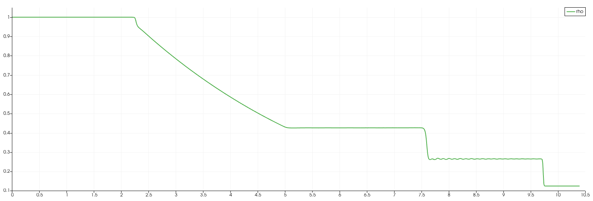

|          No.          |     1      |     2      |     3      |      4      |     5      |   6   |
| :-------------------: | :--------: | :--------: | :--------: | :---------: | :--------: | :---: |
|     $ \rho _{-} $     |    `1`     | `5.99924`  |    `1`     |     `1`     |    `1`     |  `1`  |
|     $ \rho _{+} $     |  `0.125`   | `5.99242`  |    `1`     |     `1`     |    `1`     |  `1`  |
|       $ u_{-} $       |    `0`     | `19.5975`  |    `0`     |     `0`     |    `-2`    | `-4`  |
|       $ u_{+} $       |    `0`     | `-6.19633` |    `0`     |     `0`     |    `2`     |  `4`  |
|       $ p_{-} $       |    `1`     | `460.894`  |   `1000`   |   `0.01`    |   `0.4`    | `0.4` |
|       $ p_{+} $       |   `0.1`    | `46.0950`  |   `0.01`   |    `100`    |   `0.4`    | `0.4` |
| $ t_{\mathrm{plot}} $ |   `0.25`   |  `0.035`   |  `0.012`   |   `0.035`   |   `0.15`   | `0.1` |
|       $ p_{2} $       | `0.303130` | `1691.647` | `460.8938` | `46.09504`  | `0.001894` |  `0`  |
|       $ u_{2} $       | `0.927453` | `8.689774` | `19.59745` | `-6.196328` |    `0`     |  `0`  |
|    $ \rho _{2-} $     | `0.426319` | `14.28235` | `0.575062` | `5.992417`  | `0.021852` |  `0`  |
|    $ \rho _{2+} $     | `0.265574` | `31.04260` | `5.999241` | `0.575113`  | `0.021852` |  `0`  |

No. |  1 | 2 | 3 | 4 | 5 | 6 
:-: | :-: |:-: |:-: |:-: |:-: |:-: 
$T_{-}$ | `298` | `2980` | `298e5` |`298` | `298` | `298` 
$T_{+}$ | `238.5` | `298.3754` | `298` |`298e4`| `298` | `298` 
$U_{-}$ | `(0, 0, 0)` | `(2067.7467, 0, 0)` | `(0, 0, 0)` |`(0, 0, 0)` | `(-584.8966, 0, 0)` | `(-1169.79, 0, 0)` 
$U_{+}$ | `(0, 0, 0)` | `(-653.7794, 0, 0)` | `(0, 0, 0)` | `(0, 0, 0)` | `(584.8966, 0, 0)` | `(1169.79, 0, 0)` 
$p_{-}$ | `85526` | `5130910` | `85526e5` |`85526` | `34210.4` | `34210.4` 
$p_{+}$ | `8552.6` | `513153.34` | `85526` |`85526e4` | `34210.4` | `34210.4` 
$ \Delta t $ | `1.0e-6` | `1.0e-7` | `1.0e-7` |  `1.0e-7`   | `1.0e-7` | `1.0e-7` 
 $ t_{\mathrm{plot}} $ | `0.0085` | `0.0033` | `0.00004` | `0.00012` | `0.0051` | `0.0034` 
$ p_{2} $ | `25881.8` | `1.87383e7` | `3.9425e9` |`39409` | `1885.1` | 
 $ u_{2} $ | `271.593` | `917.062` | `57285.9` | `-18121.6` | `0` | 
 $ \rho _{2-} $ | `0.4265` | `14.2262` | `0.574746` | `6.0364` | `0.0505` | 
 $ \rho _{2+} $ | `0.2650` | `31.0742` | `6.0338` | `0.574913` | `0.0505` | 
 $ u^{*} $ | `292.4483` | `105.5107` | `2924.483` | `2924.483` | `292.4483` | `292.4483` 

OpenFOAM 中的初值条件定义为 $T$, $U$, $p$ 三个物理量，采用国际单位制

| No.  |                  解析解                   |                    数值解                    |
| :--: | :---------------------------------------: | :------------------------------------------: |
|  1   |  |  |
|  2   |  |  |                         |
|  3   |  |  |
|  4   |  |  |
|  5   |  |  |
|  6   |  |  |

